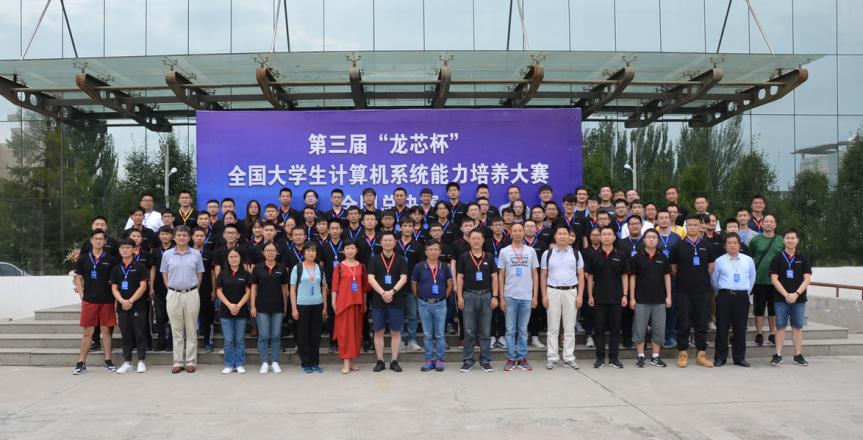
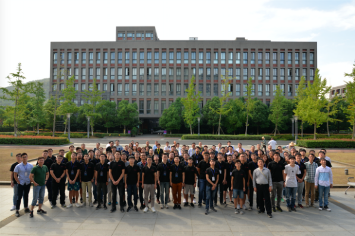

# "龙芯杯"第四届全国大学生计算机系统能力培养大赛——第一次线上培训

全国大学生计算机系统能力培养大赛是由教育部高等学校计算机类专业教学指导委员会和系统能力培养研究专家组共同发起，以学科竞赛推动专业建设和计算机领域创新人才培养体系改革、培育我国高端芯片及核心系统的技术突破与产业化后备人才为目标，面向高校大学生举办的全国性大赛。大赛旨在选拔未来我国计算机系统的设计、分析、优化与应用人才，激发学生的想象力、创新力和工程实践能力并培养其团队协作精神，以赛促学、以赛促教，为高质量专业人才搭建交流、展示、合作的平台，助力我国高校与企业产学研合作的健康快速发展。

本次大赛由中央网信办信息化发展局指导，由全国高等学校计算机教育研究会 、中国互联网发展基金会、系统能力培养研究项目示范高校联合主办，由西北工业大学承办，由龙芯中科技术有限公司、赛灵思（Xilinx）公司、机械工业出版社华章分社、中国计算机学会体系结构专委会共同协办。

图注：“龙芯杯”第二届、第三届大赛合影

对于初次参加竞赛的队员可能对赛制或技术方案理解各有不同，为防止理解出现偏颇。对此，大赛组委会特此举行赛前培训为参赛队员答疑解惑，更快的上手竞赛设备。

## 面向群体

有意愿参与此次竞赛的普通高等学校全日制在校本科生

## 时间

2020年5月14日  14：00 - 18：00

## 方式

QQ群课堂直播（QQ群号：593344130）

## 内容

| 时间          | 主讲内容                                                     | 主讲人                           |
| ------------- | ------------------------------------------------------------ | -------------------------------- |
| 14:00 - 15:00 | **团队赛** 技术方案详细解读； 大赛指定实验平台及资料发布包使用演示； 常见设计问题分析及基本调试技巧介绍。 | 龙芯中科技术有限公司 邢金璋 |
| 15:00 - 16:00 | **个人赛** 技术方案详细解读； CPU设计要求分析； 内存与外围电路设计； 功能与性能测试程序分析； 在线测试原理浅析。 | 清华大学 张宇翔             |
| 16:00 - 17:00 | **个人赛** 远程平台使用介绍及演示                       | 龙芯中科技术有限公司 张曦   |
| 17:00 - 18:00 | **FPGA架构与Vivado开发流程介绍** 7系列FPGA架构 Vivado开发流程概述 Xilinx IPI与IP Catalog介绍 时序约束与分析基础 硬件Debug | 赛灵思 刘伟                 |

## 互动

培训期间，进行有奖问答活动，抽取五位幸运听众，奖励《计算机体系结构基础（第2版）》。
由机械工业出版社华章分社友情赞助。

## FAQ

1. **设备发放时间**

   报名截止之后，2020年 6月 1 日 开始发放大赛指定的实验平台和参赛帐号

2. **vivado版本**

   2019.2

## 链接

1. **大赛官网** www.nscscc.org
2. **章程**  [第四届全国大学生计算机系统能力培养大赛章程](http://www.nscscc.org/uploads/soft/200418/1-20041P93R5.docx)

3. **团队赛**  [第四届系统能力培养大赛团队赛技术方案](http://www.nscscc.org/uploads/soft/200418/1-20041P94109.docx)

4. **团队赛** [历届NSCSCC 部分队伍开源代码](http://www.nscscc.org/a/shiyanshebei/2019/0902/59.html)
5. **个人赛** [第四届系统能力培养大赛个人赛技术方案](http://www.nscscc.org/uploads/soft/200418/1-20041P94152.docx)
6. **个人赛** 竞赛平台 [r.nscscc.org:8000](r.nscscc.org:8000)

7. **答疑平台** [龙芯问答](http://ask.loongnix.org/?/topic/%E6%95%99%E8%82%B2%E4%B8%8E%E9%AB%98%E6%A0%A1)
8. [NSCSCC2019 第一次线上培训](https://www.bilibili.com/video/BV124411J7Tu/)
9. [NSCSCC2019 第二次线上培训](https://www.bilibili.com/video/BV1Yt41137y5/)
10. **报名方法** [2020竞赛报名方法](http://www.nscscc.org/a/guanyudasai/2017/0311/13.html)

